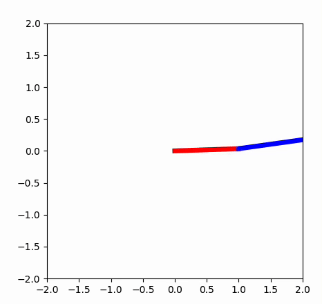
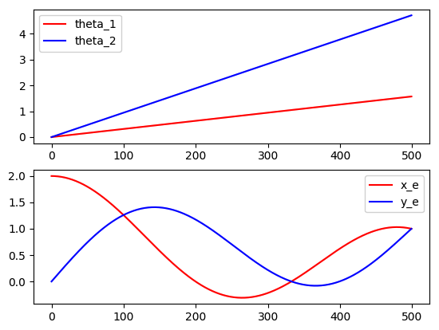
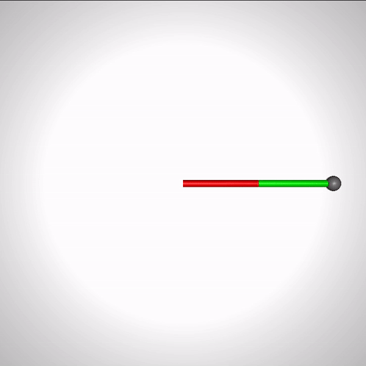
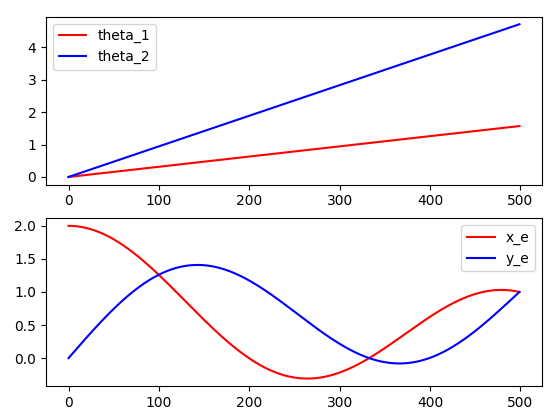
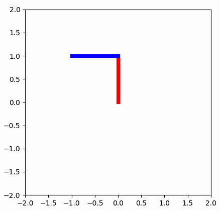
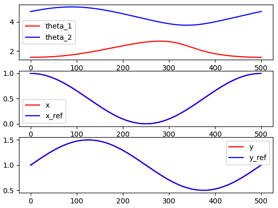
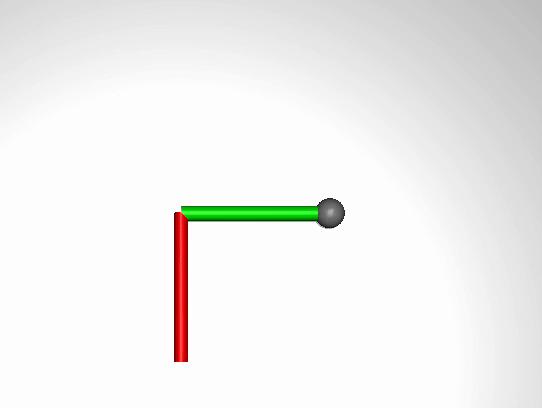
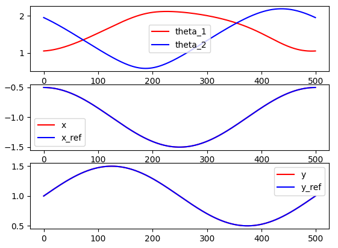

# Robotics with Python & Mujoco

## 0. 실행 확인 환경
- python 3.9
- windows, mac
- library: requirements.txt

## 1. Kinematics
```
cd manipulator_2d
```
## 1.1. Python Forward Kinematics
```
python python_forward_kinematics.py
```



## 1.2. Mujoco Forward Kinematics
```
python mujoco_forward_kinematics.py
```



## 1.3. Python Inverse Kinematics
```
python python_inverse_kinematics.py
```



## 1.4. Mujoco Inverse Kinematics
```
python mujoco_inverse_kinematics.py
```



## 2. Differential Drive

## 3. Projectile

## 4. Pendulum 1 Joint
