# Robotics with Python & Mujoco

## 0. 실행 확인 환경
- python 3.9
- windows, mac
- library: requirements.txt

## 1. Kinematics
```
cd manipulator_2d
```

## 1.1. Python Forward Kinematics
```
python python_forward_kinematics.py
```


## 1.2. Mujoco Forward Kinematics
```
python mujoco_forward_kinematics.py
```


## 1.3. Python Inverse Kinematics
```
python python_inverse_kinematics.py
```
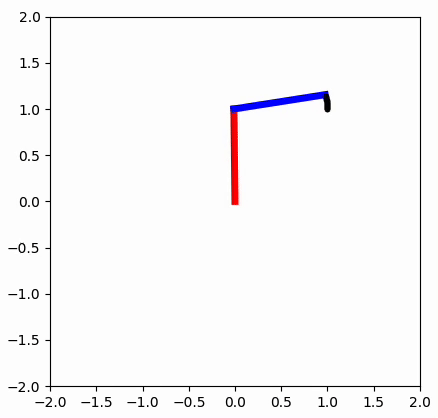


## 1.4. Mujoco Inverse Kinematics
```
python mujoco_inverse_kinematics.py
```

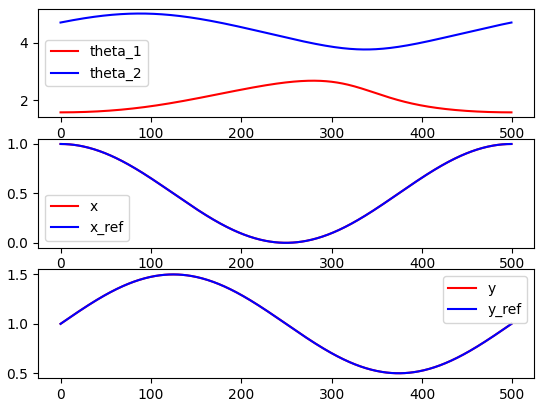

## 2. Differential Drive
```
cd differential_drive_car
```

## 2.1. Python Forward Kinematics
```
python python_forward_kinematics.py
```
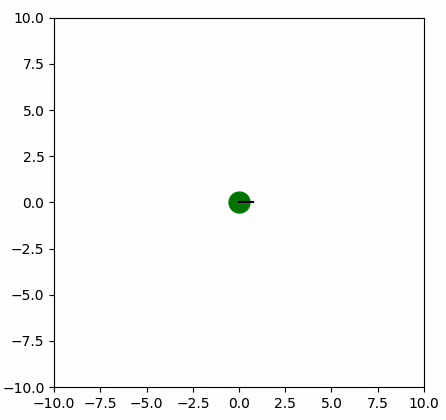
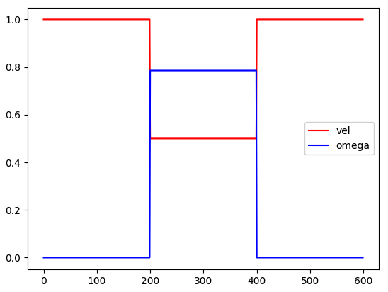

## 2.2. Mujoco Forward Kinematics
```
python mujoco_forward_kinematics.py
```
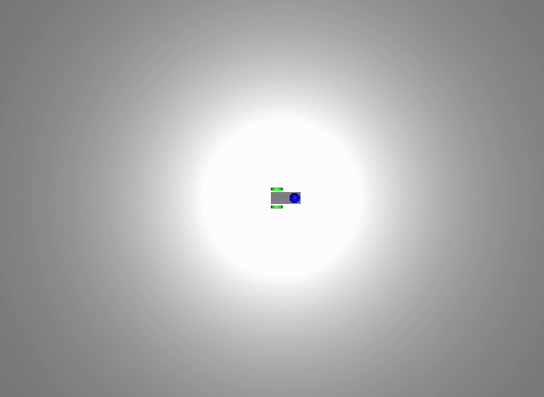
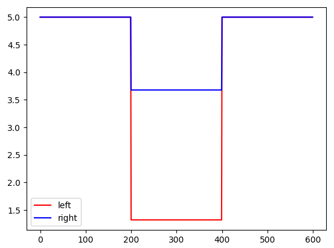

## 2.3. Python Inverse Kinematics
```
python python_inverse_kinematics.py
```


## 2.4. Mujoco Inverse Kinematics
```
python mujoco_inverse_kinematics.py
```
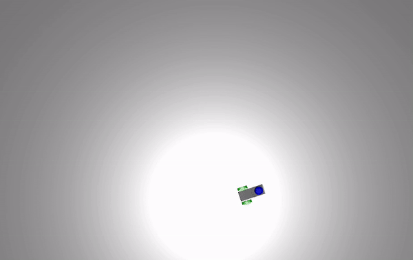
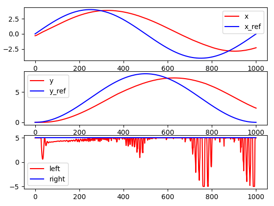

## 3. Projectile
```
cd projectile
```

## 3.1. Python Kinematics
```
python python_kinematics.py
```
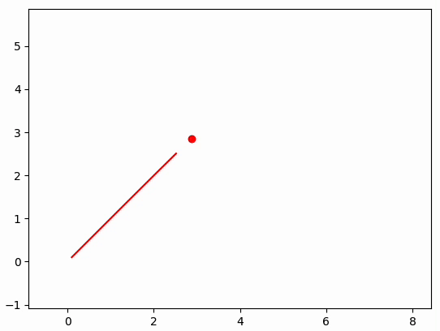
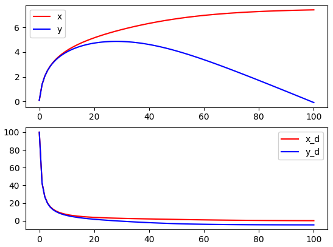

## 3.2. Mujoco Kinematics
```
python mujoco_kinematics.py
```
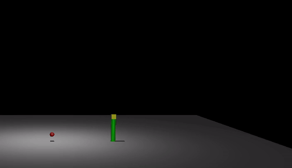


## 3.3. Mujoco Kinematics Game
```
python mujoco_kinematics_game.py
```
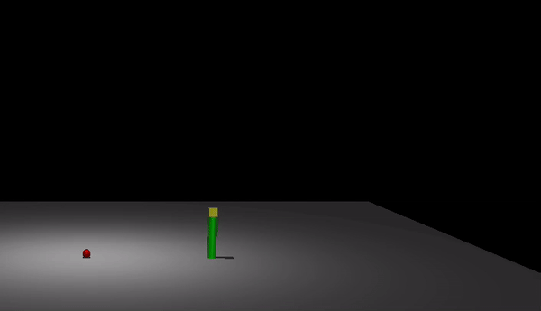

## 4. Pendulum 1 Joint

## Reference
- https://www.youtube.com/watch?v=uxvhqRTdUXE&list=PLc7bpbeTIk77plTksRXAe1JPJZVmBNk8_
- https://pab47.github.io/legs.html
- https://www.youtube.com/playlist?list=PLqVtSQw2sXKlI3idkAUBp2yX_p7wnJQF-
- https://github.com/kimsooyoung/robotics_python
